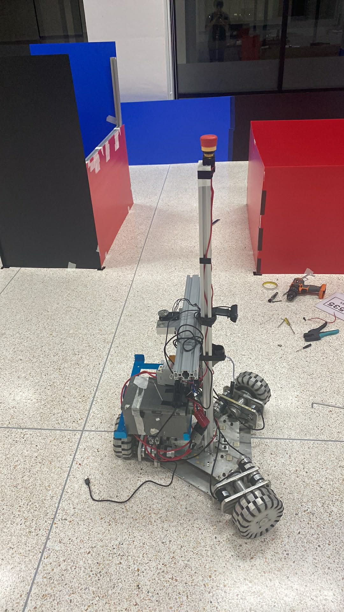
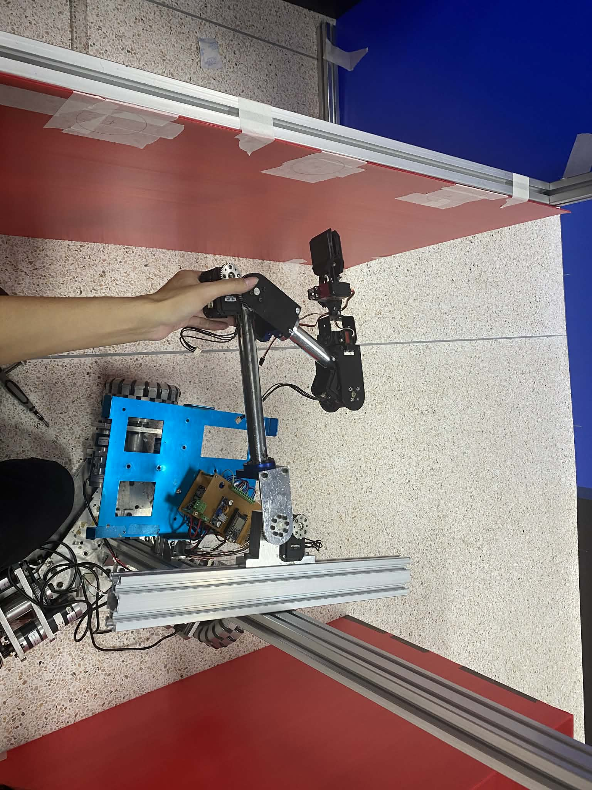

# Mobile Robot with manipulation (ROS2)

## Project Overview

This project focuses on building a complete autonomous mobile robot system using **ROS2**, simulation, and modern robotics software architecture.

The goal is to develop a deep, end-to-end understanding of robotics by implementing the entire robotics pipeline—from robot modeling and control to localization, mapping, and autonomous navigation.

The robot is developed primarily in simulation using **Gazebo** and **RViz2**, allowing it to perceive its environment through sensors such as LiDAR, generate maps, localize itself within those maps, and autonomously navigate toward goal positions.

Rather than relying purely on pre-built frameworks, this project emphasizes **learning by building and understanding each component individually**, including:

- Robot modeling (URDF/Xacro)
- Robot control
- Sensor integration
- SLAM
- Localization
- Autonomous navigation
- manipulation

The long-term vision of this project is to create a **full-stack robotics learning platform** that demonstrates how modern autonomous robots operate.

---

## Inspiration and Background

This project is inspired by a robot platform I previously worked with during the **IRAIC robotics competition in Thailand**.

I would like to express my sincere gratitude to my professor **Kitti**, who supported me and gave me the opportunity to work closely with real robotic hardware. That experience allowed me to gain a much deeper understanding of how robots function beyond simulation.

The original robot platform also competed in **RoboCup@Home**, achieving a position among the **top 16 teams in the world**.

Part of this project recreates that robot's architecture in simulation, while another part focuses on experimentation and deeper exploration of robotics algorithms.

In many ways, this project is both a **technical learning exercise and a tribute to that robot's legacy**.

Even though I am currently working primarily in simulation rather than on real hardware, every step of progress in this project reminds me of the experience and lessons I gained from that robot.


Below is the robot platform that inspired this project.  
The robot was **modified and improved by me and my team members**, so its appearance is slightly different from the original version that participated in the RoboCup competition.



---

## System Architecture

The system follows a modular ROS2 architecture:

```
Robot Model (URDF/Xacro)
        ↓
Robot State Publisher
        ↓
Gazebo Simulation
        ↓
Sensors (LiDAR / Odometry)
        ↓
SLAM Toolbox
        ↓
Map Server
        ↓
AMCL Localization
        ↓
Nav2 Navigation Stack
        ↓
Path Planning & Control
```

Key components used in the system:

- **ROS2**
- **Gazebo**
- **RViz2**
- **SLAM Toolbox**
- **Nav2 (Navigation2)**
- **ROS2 Control**
- **AMCL Localization**

---

## Current Features

The robot currently supports the following capabilities:

- Robot simulation using Gazebo
- Robot description using URDF/Xacro
- LiDAR sensor integration
- SLAM-based map generation
- Static map loading
- AMCL localization
- Nav2 autonomous navigation
- RViz visualization and debugging tools
---

## Repository Structure

```
controller
|
|── include/
|   └── controller/
|        └── velocity_pid_controller.hpp
|
|── src/
|   ├── controllers.yaml


mobile_robot/
│
├── launch/
│   ├── rsp.launch.py
│   ├── slam.launch.py
│   └── navigation.launch.py
│
├── config/
│   ├── nav2_params.yaml
│   ├── controller.yaml
│   └── rviz configuration files
│
├── maps/
│   └── saved SLAM maps
│
├── urdf/
│   └── robot description files
│
├── worlds/
│   └── Gazebo simulation environments
│
└── README.md
```

---

## Simulation Environment

The project uses the following tools for simulation and visualization:

- **ROS2**
- **Gazebo**
- **RViz2**
- **TurtleBot3 simulation worlds**

The robot operates inside a simulated indoor environment where it uses LiDAR data to perceive obstacles and navigate safely.

---

## Navigation Pipeline

The navigation process follows the typical ROS2 navigation workflow:

1. **SLAM Toolbox** generates a map of the environment.
2. The map is saved using **Map Server**.
3. **AMCL** localizes the robot inside the map.
4. **Nav2 Planner** generates a global path to the goal.
5. **Nav2 Controller** generates velocity commands.
6. The robot follows the path while avoiding obstacles.

---

## How to Run the Project

### Build the workspace

```bash
colcon build --merge-install
source install/setup.bash
```

### Launch the simulation

```bash
ros2 launch mobile_robot navigation.launch.py
```

### Visualize in RViz

RViz will display:

- Robot model
- LiDAR scan
- Map
- Costmaps
- Global path
- Local path

---

## Future Work

Planned improvements include:

- Custom Behavior Trees for navigation
- Advanced obstacle avoidance
- Multi-room navigation
- Object detection and semantic mapping
- Integration with real robot hardware
- Multi-robot coordination
- Reinforcement learning for navigation

---

## Learning Goals

This project aims to strengthen understanding in:

- ROS2 system architecture
- Robot kinematics and motion control
- SLAM algorithms
- Localization methods
- Autonomous navigation systems
- Robotics software engineering

---

## Contributions and Feedback

This project is part of an ongoing learning journey, and feedback is always welcome.

If you notice something that could be improved or corrected, feel free to open an issue or reach out. Constructive suggestions and discussions are greatly appreciated.