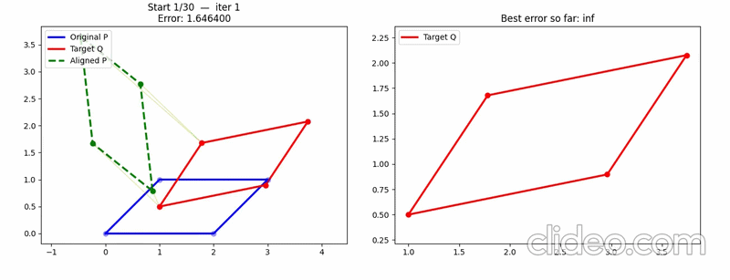

## 🔄 Iterative Closest Point (ICP)

### Objective

The purpose of implementing and understanding the ICP algorithm is to estimate the robot’s pose using LiDAR scan data. Since laser scans provide geometric information about the environment, they can be used to infer the relative transformation between consecutive frames.  

By estimating this transformation, we can derive the robot’s **odometry**, which can later be fused with other sensors to improve localization accuracy.

---

### Problem Formulation

Given two point clouds:

$$
P = \{p_i\}, \quad Q = \{q_j\}
$$

- \( P \): reference point cloud  
- \( Q \): current point cloud  

The goal is to find the optimal transformation (rotation \( R \) and translation \( t \)) that aligns \( P \) to \( Q \):

$$
\min_{R, t} \sum_{i} \| R p_i + t - q_i^* \|^2
$$

where:

$$
q_i^* = \arg\min_{q_j \in Q} \| p_i - q_j \|
$$

This means that for each point \( p_i \), we find the **closest corresponding point** in \( Q \). Note that the correspondence is not necessarily unique, and multiple points in \( P \) may map to similar regions in \( Q \).

---

### ICP Algorithm Steps

#### Step 1: Compute Centroids
$$
\bar{p} = \frac{1}{n} \sum p_i, \quad
\bar{q} = \frac{1}{n} \sum q_i^*
$$

Compute the centroids of both point sets to estimate translation.

---

#### Step 2: Center the Points
$$
p'_i = p_i - \bar{p}, \quad
q'_i = q_i^* - \bar{q}
$$

Shift both point clouds to their respective centroids.

---

#### Step 3: Covariance Matrix
$$
H = \sum p'_i (q'_i)^T
$$

Compute the covariance matrix between the centered point sets.

---

#### Step 4: Singular Value Decomposition (SVD)
$$
H = U \Sigma V^T
$$

---

#### Step 5: Compute Rotation
$$
R = V U^T
$$

---

#### Step 6: Compute Translation
$$
t = \bar{q} - R \bar{p}
$$

---

#### Step 7: Update Points
$$
p_i \leftarrow R p_i + t
$$

Repeat the process until convergence (i.e., the alignment error is sufficiently small).

---

### Implementation

The implementation of this algorithm can be found in

"src/algorithm/algo_visulize/ICP/ICP_simple_shape.py"

This script demonstrates how ICP estimates the transformation between two point clouds and visualizes the alignment process.

---

### Limitations of ICP

Although ICP is effective for point cloud alignment, it has several limitations:

- **Local minima:**  
  The algorithm may converge to an incorrect solution if the initial alignment is poor.

- **Sensitivity to initialization:**  
  ICP performs best when the initial guess is close to the true transformation.

- **Ambiguity in symmetric environments:**  
  Similar structures can lead to incorrect correspondences.

To mitigate these issues, one possible approach is to use **multiple initial guesses** (e.g., random initialization of \( R \) and \( t \)). By running ICP multiple times, the likelihood of converging to the correct global solution increases.

---

### Demonstration

The following example shows ICP aligning two point clouds:

